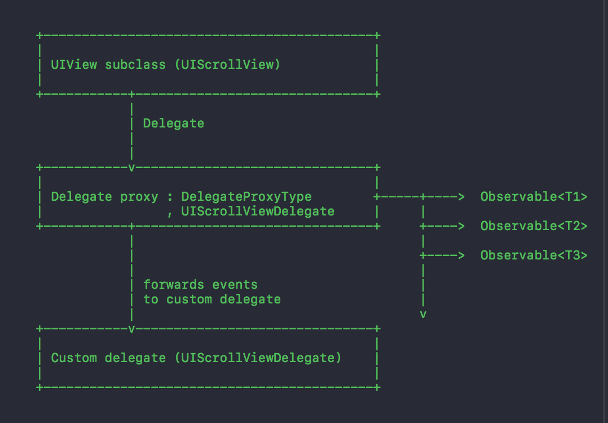

## RxSwift(part2)

[RxSwift GitHub](https://github.com/ReactiveX/RxSwift)

### RxCocoa APIS

* NSObject

> Observe

```

func showArticle() -> Observable<Bool> {
        return articleModel.rx.observe(Int.self, "type").map { optionalType -> Bool in
            guard let type = optionalType else {
                return false
            }
            return type == 0 ? true : false
        }
    }

```

<!--more-->

* UIActivityIndicatorView

```

	/// Bindable sink for `startAnimating()`, `stopAnimating()` methods.
    public var isAnimating: UIBindingObserver<Base, Bool>

```
* UIAlertAction

```
	/// Bindable sink for `enabled` property.
	public var isEnabled: UIBindingObserver<Base, Bool>

```

* UIApplication

```
	/// Bindable sink for `networkActivityIndicatorVisible`.
	public var isNetworkActivityIndicatorVisible: UIBindingObserver<Base, Bool>

```

* UIBarButtonItem

```

/// Bindable sink for `enabled` property.
    public var isEnabled: UIBindingObserver<Base, Bool>
    
/// Bindable sink for `title` property.
    public var title: UIBindingObserver<Base, String>

/// Reactive wrapper for target action pattern on `self`.
    public var tap: ControlEvent<Void> 
```

* UIButton

```
/// Reactive wrapper for `TouchUpInside` control event.
    public var tap: ControlEvent<Void>

```

* UICollectionView

```

public func items<S: Sequence, O: ObservableType>
        (_ source: O)
        -> (_ cellFactory: @escaping (UICollectionView, Int, S.Iterator.Element) -> UICollectionViewCell)
        -> Disposable where O.E == S
 
 public func setDataSource(_ dataSource: UICollectionViewDataSource)
        -> Disposable
 
 public var itemSelected: ControlEvent<IndexPath> 
 
 public var itemDeselected: ControlEvent<IndexPath> 
 
 public func modelSelected<T>(_ modelType: T.Type) -> ControlEvent<T>
 
 public func modelDeselected<T>(_ modelType: T.Type) -> ControlEvent<T>
 
 public func model<T>(at indexPath: IndexPath) throws -> T 
 

```

* UIControl

```
/// Bindable sink for `enabled` property.
    public var isEnabled: UIBindingObserver<Base, Bool>
    
    /// Bindable sink for `selected` property.
    public var isSelected: UIBindingObserver<Base, Bool>
    
    /// Reactive wrapper for target action pattern.
    ///
    /// - parameter controlEvents: Filter for observed event types.
    public func controlEvent(_ controlEvents: UIControlEvents) -> ControlEvent<Void>
    

```

* UIDatePicker

```
/// Reactive wrapper for `date` property.
    public var date: ControlProperty<Date>
    
    /// Reactive wrapper for `date` property.
    public var value: ControlProperty<Date> 

```

* UIGestureRecognizer

```
/// Reactive wrapper for gesture recognizer events.
    public var event: ControlEvent<Base>
    
```

* UIImageView

```
/// Bindable sink for `image` property.
public var image: UIBindingObserver<Base, UIImage?>

```

* UILabel

```
/// Bindable sink for `text` property.
    public var text: UIBindingObserver<Base, String?>
    
/// Bindable sink for `attributedText` property.
	public var attributedText: UIBindingObserver<Base, NSAttributedString?>

```

* UINavigationController

```
/// Reactive wrapper for delegate method `navigationController(:willShow:animated:)`.
    public var willShow: ControlEvent<ShowEvent>
    
/// Reactive wrapper for delegate method `navigationController(:didShow:animated:)`.
    public var didShow: ControlEvent<ShowEvent> 

```

* UINavigationItem

```
/// Bindable sink for `title` property.
    public var title: UIBindingObserver<Base, String?>

```

### RxCocoa Highlighted API


* bind

```

/**
    Creates new subscription and sends elements to observer.
    
    In this form it's equivalent to `subscribe` method, but it communicates intent better, and enables
    writing more consistent binding code.
    
    - parameter to: Observer that receives events.
    - returns: Disposable object that can be used to unsubscribe the observer.
    */
    public func bind<O: ObserverType>(to observer: O) -> Disposable where O.E == E {
        return self.subscribe(observer)
    }

```

example 1

```

 example("PublishSubject"){
            
            // PublishSubject
            
            let subject = PublishSubject<String>()
            let bindSubject = PublishSubject<String>()
            
            subject.addObserver("2").disposed(by: disposeBag)
            
            subject.bind(to: bindSubject).addDisposableTo(disposeBag)
            
            bindSubject.subscribe(onNext: { (str) in
                print("bind----\(str)")
            }).addDisposableTo(disposeBag)
            
            subject.onNext("🅱️")
            
        }
        
--- PublishSubject example ---

Subscription: 2 Event: next(🅱️)
bind----🅱️

```

example 2

```
cameraButton.rx.tap
            .flatMapLatest { [weak self] _ in
                return UIImagePickerController.rx.createWithParent(self) { picker in
                    picker.sourceType = .camera
                    picker.allowsEditing = false
                }
                .flatMap { $0.rx.didFinishPickingMediaWithInfo }
                .take(1)
            }
            .map { info in
                return info[UIImagePickerControllerOriginalImage] as? UIImage
            }
            .bind(to: imageView.rx.image)
            .disposed(by: disposeBag)

```

* UIBindingObserver

> RxCocoa UI组件值绑定核心

```

/**
Observer that enforces interface binding rules:
 * can't bind errors (in debug builds binding of errors causes `fatalError` in release builds errors are being logged)
 * ensures binding is performed on main thread
 
`UIBindingObserver` doesn't retain target interface and in case owned interface element is released, element isn't bound.
 
 In case event binding is attempted from non main dispatch queue, event binding will be dispatched async to main dispatch
 queue.
*/

public final class UIBindingObserver<UIElementType, Value> : ObserverType where UIElementType: AnyObject {
    public typealias E = Value

    weak var UIElement: UIElementType?

    let binding: (UIElementType, Value) -> Void

    /// Initializes `ViewBindingObserver` using
    public init(UIElement: UIElementType, binding: @escaping (UIElementType, Value) -> Void) {
        self.UIElement = UIElement
        self.binding = binding
    }

    /// Binds next element to owner view as described in `binding`.
    public func on(_ event: Event<Value>) {
        if !DispatchQueue.isMain {
            DispatchQueue.main.async {
                self.on(event)
            }
            return
        }

        switch event {
        case .next(let element):
            if let view = self.UIElement {
                binding(view, element)
            }
        case .error(let error):
            bindingErrorToInterface(error)
        case .completed:
            break
        }
    }

    /// Erases type of observer.
    ///
    /// - returns: type erased observer.
    public func asObserver() -> AnyObserver<Value> {
        return AnyObserver(eventHandler: on)
    }
}

```


```
UIControl+Rx

/// Bindable sink for `enabled` property.
    public var isEnabled: UIBindingObserver<Base, Bool> {
        return UIBindingObserver(UIElement: self.base) { (owner, value) in
            owner.isEnabled = value
        }
    }

```

example

```

let control = UIControl(frame: CGRect(x: 0, y: 0, width: 1, height: 1))
        
          _ = Observable.just(true).bind(to: control.rx.isEnabled)

```

* ControlEvent

> RxCocoa UI组件点击事件绑定核心

> 类定义

```

/// Protocol that enables extension of `ControlEvent`.
public protocol ControlEventType : ObservableType {

    /// - returns: `ControlEvent` interface
    func asControlEvent() -> ControlEvent<E>
}

/**
    Trait for `Observable`/`ObservableType` that represents event on UI element.

    It's properties are:

    - it never fails
    - it won't send any initial value on subscription
    - it will `Complete` sequence on control being deallocated
    - it never errors out
    - it delivers events on `MainScheduler.instance`

    **The implementation of `ControlEvent` will ensure that sequence of events is being subscribed on main scheduler
     (`subscribeOn(ConcurrentMainScheduler.instance)` behavior).**

    **It is implementor's responsibility to make sure that that all other properties enumerated above are satisfied.**

    **If they aren't, then using this trait communicates wrong properties and could potentially break someone's code.**

    **In case `events` observable sequence that is being passed into initializer doesn't satisfy all enumerated
     properties, please don't use this unit.**
*/
public struct ControlEvent<PropertyType> : ControlEventType {
    public typealias E = PropertyType

    let _events: Observable<PropertyType>

    /// Initializes control event with a observable sequence that represents events.
    ///
    /// - parameter events: Observable sequence that represents events.
    /// - returns: Control event created with a observable sequence of events.
    public init<Ev: ObservableType>(events: Ev) where Ev.E == E {
        _events = events.subscribeOn(ConcurrentMainScheduler.instance)
    }

    /// Subscribes an observer to control events.
    ///
    /// - parameter observer: Observer to subscribe to events.
    /// - returns: Disposable object that can be used to unsubscribe the observer from receiving control events.
    public func subscribe<O : ObserverType>(_ observer: O) -> Disposable where O.E == E {
        return _events.subscribe(observer)
    }

    /// - returns: `Observable` interface.
    public func asObservable() -> Observable<E> {
        return _events
    }

    /// - returns: `ControlEvent` interface.
    public func asControlEvent() -> ControlEvent<E> {
        return self
    }
}

```

> 封装

```
/// Reactive wrapper for target action pattern.
    ///
    /// - parameter controlEvents: Filter for observed event types.
    public func controlEvent(_ controlEvents: UIControlEvents) -> ControlEvent<Void> {
        let source: Observable<Void> = Observable.create { [weak control = self.base] observer in
            MainScheduler.ensureExecutingOnScheduler()

            guard let control = control else {
                observer.on(.completed)
                return Disposables.create()
            }

            let controlTarget = ControlTarget(control: control, controlEvents: controlEvents) {
                control in
                observer.on(.next())
            }
            
            return Disposables.create(with: controlTarget.dispose)
        }.takeUntil(deallocated)

        return ControlEvent(events: source)
    }

```

> 使用

```
extension Reactive where Base: UIButton {
    
    /// Reactive wrapper for `TouchUpInside` control event.
    public var tap: ControlEvent<Void> {
        return controlEvent(.touchUpInside)
    }
}

```


* Driver

> 用法同 bind(to )
> 
> 专门针对于UI的特定可观察者类
  
特性
  
> 它不会发射出错误(Error)事件

> 对它的观察订阅是发生在主线程(UI线程)的

> 自带shareReplayLatestWhileConnected 

```

/**
 Trait that represents observable sequence with following properties:

 - it never fails
 - it delivers events on `MainScheduler.instance`
 - `shareReplayLatestWhileConnected()` behavior
 - all observers share sequence computation resources
 - it's stateful, upon subscription (calling subscribe) last element is immediatelly replayed if it was produced
 - computation of elements is reference counted with respect to the number of observers
 - if there are no subscribers, it will release sequence computation resources

 `Driver<Element>` can be considered a builder pattern for observable sequences that drive the application.

 If observable sequence has produced at least one element, after new subscription is made last produced element will be
 immediately replayed on the same thread on which the subscription was made.

 When using `drive*`, `subscribe*` and `bind*` family of methods, they should always be called from main thread.

 If `drive*`, `subscribe*` and `bind*` are called from background thread, it is possible that initial replay
 will happen on background thread, and subsequent events will arrive on main thread.

 To find out more about traits and how to use them, please visit `Documentation/Traits.md`.
 */
public typealias Driver<E> = SharedSequence<DriverSharingStrategy, E>


```

```

  asDriver(onErrorJustReturn onErrorJustReturn: Self.E)

  asDriver(onErrorDriveWith onErrorDriveWith: RxCocoa.Driver<Self.E>)

  asDriver(onErrorRecover onErrorRecover: (error: ErrorType) -> RxCocoa.Driver<Self.E>)
  

```

* DisposeBag

> 类似于Objective-C ARC中的自动释放池机制。
> 
> 方法addDisposableTo会对DisposeBag进行弱引用，所以这个DisposeBag要被实例引用着，一般可作为实例的成员变量，当实例被销毁了，成员DisposeBag会跟着销毁，从而使得RxSwift在此实例上绑定的资源得到释放。


<!--### 补充: Objective-C的消息传递

[从源代码看 ObjC 中消息的发送](http://draveness.me/message.html)

[深入解析 ObjC 中方法的结构](http://draveness.me/method-struct.html)

#### 基本消息传递

> 在面向对象编程中，对象调用方法叫做发送消息。
> 在编译时，程序的源代码就会从对象发送消息转换成Runtime的objc_msgSend函数调用。
> 例如某实例变量receiver实现某一个方法oneMethod

```
[receiver oneMethod];

```
> Runtime会将其转成类似这样的代码

```
objc_msgSend(receiver, selector);

```

> 具体的Runtime会根据类型自动转换成下列某一个函数：
> 
> objc_msgSend:普通的消息都会通过该函数发送
> 
> objc_msgSend_stret:消息中有数据结构作为返回值（不是简单值）时，通过此函数发送和接收返回值
> 
> objc_msgSendSuper:和objc_msgSend类似，这里把消息发送给父类的实例
> 
> objc_msgSendSuper_stret:和objc_msgSend_stret类似，这里把消息发送给父类的实例并接收返回值
> 


* objc_msgSend函数的调用过程：

> * 第一步：检测这个selector是不是要忽略的。
> 
> * 第二步：检测这个target是不是nil对象。nil对象发送任何一个消息都会被忽略掉。
> * 第三步：
> 		* 1.调用实例方法时，它会首先在自身isa指针指向的类（class）methodLists中查找该方法，如果找不到则会通过class的super_class指针找到父类的类对象结构体，然后从methodLists中查找该方法，如果仍然找不到，则继续通过super_class向上一级父类结构体中查找，直至根class；
> 		* 2.当我们调用某个某个类方法时，它会首先通过自己的isa指针找到metaclass，并从其中methodLists中查找该类方法，如果找不到则会通过metaclass的super_class指针找到父类的metaclass对象结构体，然后从methodLists中查找该方法，如果仍然找不到，则继续通过super_class向上一级父类结构体中查找，直至根metaclass；
> * 第四部：前三部都找不到就会进入动态方法解析

#### 消息动态解析

* 动态解析流程图


> * 第一步：通过resolveInstanceMethod：方法决定是否动态添加方法。如果返回Yes则通过class_addMethod动态添加方法，消息得到处理，结束；如果返回No，则进入下一步；
> * 第二步：这步会进入forwardingTargetForSelector:方法，用于指定备选对象响应这个selector，不能指定为self。如果返回某个对象则会调用对象的方法，结束。如果返回nil，则进入第三部；
> * 第三部：这步我们要通过methodSignatureForSelector:方法签名，如果返回nil，则消息无法处理。如果返回methodSignature，则进入下一步；
> * 第四部：这步调用forwardInvocation：方法，我们可以通过anInvocation对象做很多处理，比如修改实现方法，修改响应对象等，如果方法调用成功，则结束。如果失败，则进入doesNotRecognizeSelector方法，若我们没有实现这个方法，那么就会crash。-->

### RxSwift 中的DelegateProxy

* proxy 流程图



* 具体关系及方法响应 (UITableViewDelegate举例)


```
 	 let dataSource = RxTableViewSectionedReloadDataSource<SectionModel<String, Double>>()

    let delegate = RxTableViewSectionedReloadDelegate<SectionModel<String, Double>>()

    override func viewDidLoad() {
        super.viewDidLoad()
        
        let dataSource = self.dataSource
        let delegate = self.delegate
        
        let items = Observable.just([
            SectionModel(model: "First section", items: [
                1.0,
                2.0,
                3.0
                ]),
            SectionModel(model: "Second section", items: [
                1.0,
                2.0,
                3.0
                ]),
            SectionModel(model: "Third section", items: [
                1.0,
                2.0,
                3.0
                ])
            ])
        
        dataSource.configureCell = { (_, tv, indexPath, element) in
            let cell = tv.dequeueReusableCell(withIdentifier: "Cell")!
            cell.textLabel?.text = "\(element) @ row \(indexPath.row)"
            return cell
        }
        
        delegate.configureSection = { (_, tv, indexPath, element, type) in
            var identifier = "section"
            var sectionClass: AnyClass = FirstViewHeader.self
            if indexPath.section == 0 {
                tv.register(sectionClass, forHeaderFooterViewReuseIdentifier: identifier)
            }else if indexPath.section == 1 {
                identifier = "FirstSection"
                sectionClass = SecondViewHeader.self
                tv.register(sectionClass, forHeaderFooterViewReuseIdentifier: identifier)
            }else{
                identifier = "SecondSection"
                sectionClass = ThirdViewHeader.self
                tv.register(sectionClass, forHeaderFooterViewReuseIdentifier: identifier)
            }

            var v: RxTableViewSectionProxy
            if let view = tv.dequeueReusableHeaderFooterView(withIdentifier: identifier) as? RxTableViewSectionProxy {
                v = view
            }else {
                v = RxTableViewSectionProxy(reuseIdentifier: identifier)
            }
            v.textLabel?.text = "\(element)"
            v.contentView.backgroundColor = .randomColor
            print("react____\(v)")
            return v
        }
        
        delegate.sectionAndCellHeight = { (_, tv, indexPath, element, type) in
            var sectionClass: SimpleViewHeader.Type = FirstViewHeader.self
            if indexPath.section == 0 {
            }else if indexPath.section == 1 {
                sectionClass = SecondViewHeader.self
            }else{
                sectionClass = ThirdViewHeader.self
            }
            
            return sectionClass.heightForSection(withItem: element as AnyObject, indexPath: indexPath, sectionType: type)
        }
        delegate.cellHeight = { (_, tv, indexPath, element, type) in
            var sectionClass: SimpleViewHeader.Type = FirstViewHeader.self
            if indexPath.section == 0 {
            }else if indexPath.section == 1 {
                sectionClass = SecondViewHeader.self
            }else{
                sectionClass = ThirdViewHeader.self
            }
            
            return sectionClass.heightForSection(withItem: element as AnyObject, indexPath: indexPath, sectionType: type)
        }
        
        items
            .bind(to: tableView.rx.items(dataSource: dataSource))
            .disposed(by: disposeBag)
        
        items.bind(to: tableView.rx.sectionViews(delegate: delegate))
             .disposed(by: disposeBag)
        
        tableView.rx
            .itemSelected
            .map { indexPath in
                return (indexPath, dataSource[indexPath])
            }
            .subscribe(onNext: { indexPath, model in
                DefaultWireframe.presentAlert("Tapped `\(model)` @ \(indexPath)")
            })
            .disposed(by: disposeBag)
    }


```

---

### Delegate 创建 数据与dataSource 的绑定

* _TableViewSectionedDataSource 继承自 UITableViewDataSource, NSObject

```
// 子类复写
open func _rx_numberOfSections(in tableView: UITableView) -> Int {
        return 1
    }
    
// 代理方法
open func numberOfSections(in tableView: UITableView) -> Int {
    return _rx_numberOfSections(in: tableView)
}

```

* TableViewSectionedDataSource 继承自 _TableViewSectionedDataSource 增加cell 创建的闭包 // 扩展, 增加cellheight 的闭包, sectionView 的闭包 & 分区高度的闭包

```
open override func _rx_tableView(_ tableView: UITableView, cellForRowAt indexPath: IndexPath) -> UITableViewCell {
        precondition(indexPath.item < _sectionModels[indexPath.section].items.count)
        
        return configureCell(self, tableView, indexPath, self[indexPath])
    }

```

* RxTableViewSectionedReloadDataSource<S: SectionModelType> 继承自TableViewSectionedDatsSource & Protocol RxTableViewDataSourceType
* 根据实现协议 RxTableViewDataSourceType 来绑定外部数据源

```

open func tableView(_ tableView: UITableView, observedEvent: Event<Element>) {
        UIBindingObserver(UIElement: self) { dataSource, element in
            #if DEBUG
                self._dataSourceBound = true
            #endif
            dataSource.setSections(element)
            
            tableView.reloadData()
        }.on(observedEvent)
    }
    
-------TableViewSectionedDataSource------

 open func setSections(_ sections: [S]) {
    self._sectionModels = sections.map { SectionModelSnapshot(model: $0, items: $0.items) }
}

```

### UITableView 与Delegate 绑定


* 核心绑定方法---> ObservableType 的扩展

```
 func subscribeProxyDataSource<P: DelegateProxyType>(ofObject object: UIView, dataSource: AnyObject, retainDataSource: Bool, binding: @escaping (P, Event<E>) -> Void)
                -> Disposable {
                // 创建或者查找委托
                let proxy = P.proxyForObject(object)
                // 创建代理&绑定object 代理方法响应的对象
                let unregisterDelegate = P.installForwardDelegate(dataSource, retainDelegate: retainDataSource, onProxyForObject: object)
                // this is needed to flush any delayed old state (https://github.com/RxSwiftCommunity/RxDataSources/pull/75)
                object.layoutIfNeeded()

                let subscription = self.asObservable()
                    .observeOn(MainScheduler())
                    .catchError { error in
                        bindingErrorToInterface(error)
                        return Observable.empty()
                    }
                    // source can never end, otherwise it would release the subscriber, and deallocate the data source
                    .concat(Observable.never())
                    .takeUntil(object.rx.deallocated)
                    .subscribe { [weak object] (event: Event<E>) in
                        if let object = object {
                            assert(proxy === P.currentDelegateFor(object), "Proxy changed from the time it was first set.\nOriginal: \(proxy)\nExisting: \(String(describing: P.currentDelegateFor(object)))")
                        }
                        
                        // 通过该句实现数据源数据的传递, event 携带数据
                        binding(proxy, event)
                        
                        switch event {
                        case .error(let error):
                            bindingErrorToInterface(error)
                            unregisterDelegate.dispose()
                        case .completed:
                            unregisterDelegate.dispose()
                        default:
                            break
                        }
                    }
                    
                return Disposables.create { [weak object] in
                    subscription.dispose()
                    object?.layoutIfNeeded()
                    unregisterDelegate.dispose()
                }
            }
```

**binding 闭包的实现**

```
 guard let tableView = tableView else {
                        return
                    }
                    
delegate.tableView(tableView, observedEvent: event)

```

* P.proxyForObject(object)

```
    public static func proxyForObject(_ object: AnyObject) -> Self {
		MainScheduler.ensureExecutingOnScheduler()

        let maybeProxy = Self.assignedProxyFor(object) as? Self

        let proxy: Self
        if let existingProxy = maybeProxy {
            proxy = existingProxy
        }
        else {
            proxy = Self.createProxyForObject(object) as! Self
            Self.assignProxy(proxy, toObject: object)
        }
        
        let currentDelegate: AnyObject? = Self.currentDelegateFor(object)
        if currentDelegate !== proxy {
            proxy.setForwardToDelegate(currentDelegate, retainDelegate: false)
            Self.setCurrentDelegate(proxy, toObject: object)
        }

        return proxy
       }
```

* 仔细分析 let unregisterDelegate = P.installForwardDelegate(dataSource, retainDelegate: retainDataSource, onProxyForObject: object)

```

 public static func installForwardDelegate(_ forwardDelegate: AnyObject, retainDelegate: Bool, onProxyForObject object: AnyObject) -> Disposable {

        .........proxy.forwardToDelegate()为空校验.........

        proxy.setForwardToDelegate(forwardDelegate, retainDelegate: retainDelegate)
        
        .........根据runtime动态方法响应实现绑定.........

```

*  proxy.setForwardToDelegate(forwardDelegate, retainDelegate: retainDelegate) 的objc 实现

```
open func setForwardToDelegate(_ delegate: AnyObject?, retainDelegate: Bool) {
        #if DEBUG // 4.0 all configurations
            MainScheduler.ensureExecutingOnScheduler()
        #endif
        self._setForward(toDelegate: delegate, retainDelegate: retainDelegate)
        self.reset()
    }
    
internal func reset() {
    guard let delegateProxySelf = self as? DelegateProxyType else {
        rxFatalErrorInDebug("\(self) doesn't implement delegate proxy type.")
        return
    }
    
    guard let parentObject = self.parentObject else { return }

    let selfType = type(of: delegateProxySelf)

    let maybeCurrentDelegate = selfType.currentDelegateFor(parentObject)

    if maybeCurrentDelegate === self {
        selfType.setCurrentDelegate(nil, toObject: parentObject)
        selfType.setCurrentDelegate(self, toObject: parentObject)
    }
}

```

```
UITableViewDataSource 的重写 将data 驱动的dataSource 与tableView关联
    public class func setCurrentDelegate(_ delegate: AnyObject?, toObject object: AnyObject) {
        let tableView: UITableView = castOrFatalError(object)
        tableView.dataSource = castOptionalOrFatalError(delegate)
    }

```

```

-(id)_forwardToDelegate {
    return __forwardToDelegate;
}

-(void)_setForwardToDelegate:(id __nullable)forwardToDelegate retainDelegate:(BOOL)retainDelegate {
    __forwardToDelegate = forwardToDelegate;
    
    if (retainDelegate) {
        self.strongForwardDelegate = forwardToDelegate;
    }
    else {
        self.strongForwardDelegate = nil;
    }
}

```


* 通过对UIKit 增加扩展来返回 RxDelegateProxy 的实例对象

```

extension UITableView {
 
    /**
    Factory method that enables subclasses to implement their own `delegate`.
    
    - returns: Instance of delegate proxy that wraps `delegate`.
    */
    public override func createRxDelegateProxy() -> RxTableViewDelegateProxy {
        return RxTableViewDelegateProxy(parentObject: self)
    }

    /**
    Factory method that enables subclasses to implement their own `rx.dataSource`.
    
    - returns: Instance of delegate proxy that wraps `dataSource`.
    */
    public func createRxDataSourceProxy() -> RxTableViewDataSourceProxy {
        return RxTableViewDataSourceProxy(parentObject: self)
    }

}

```