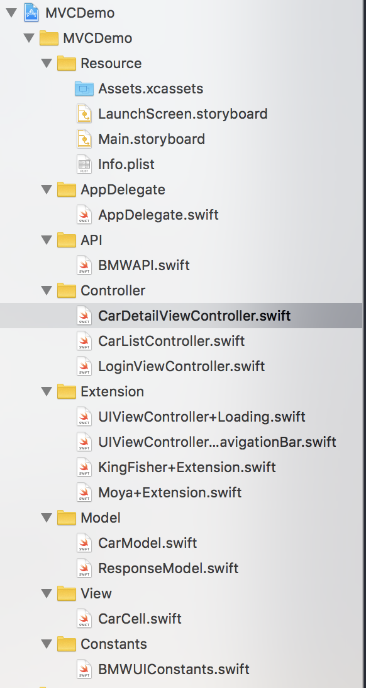

## MVC:

### 项目结构:


#### View:

SnapKit 纯代码布局 同OBJC下的 Masonry

```
titleLabel = {
            let label = UILabel()
            contentView.addSubview(label)
            label.snp.makeConstraints({ (make) in
                make.top.equalTo(WHScale(27))
                make.left.equalTo(WHScale(20))
            })
            label.font = .systemFont(ofSize: WHScale(15))
            label.textColor = RGBSameColor(68)
            return label
        }()

```

#### Controller:

同OBJC 下的controller
> 依旧是组合视图, 请求网络, 展示数据的粘合剂

```
override func viewDidLoad() {
        
        super.viewDidLoad()
        view.backgroundColor = .white
        
        setupNavBar()
        setupView()
        
        fetchCarDetail()
    }

```

#### Model:
遵循 Codable协议 的class 或者 struct

```
struct ResObject<T: Codable>: Codable {
    
    var data: T?
    var ret: Int
    var detail: String?
}

struct ReponseData<T: Codable>: Codable {
    
    var cars: [T]?
    var pageNo: Int
    var stickCar: T?
    
    enum CodingKeys:String, CodingKey {
        case cars
        case pageNo = "page_no"
        case stickCar = "stick_car"
    }
}

struct CarModel: Codable {
    
    var model: String
    var brand: String
    var picUrl: String
    var vin: String
    var year: Int
    var mileageTime: Int?
    var mileage: Int?
    
    enum CodingKeys:String, CodingKey {
        
        case model
        case brand
        case picUrl = "pic_url"
        case vin
        case year
        case mileageTime = "mileage_time"
        case mileage
    }
}

```

#### network:
Moya

```
	showLoading()
    BMWProvider.request(.carDetail(vin!)) { result in
        
        self.dismissLoading()
        
        let (model, error) = parseResult(result,
                                  modelType:CarModel.self,
                                   keypath: "data.car_profile")
        
        
        if let errorString = error {
        	  // toast outside
            print(errorString)
            return
        }
        // get result & use
        self.updateView(model!)
    }

```

基于Codable 对Moya的Result 的扩展处理

```

func parseResult<T: Codable>(_ result: Result<Moya.Response, MoyaError>, modelType: T.Type, keypath: String? = nil) -> (T?, String?) {
    
    switch result {
    case .success(let response):
        
        return parseResponse(response,
                             modelType:T.self,
                             keypath: keypath)
        
    case .failure(let error):
        return (nil, "\(error)")
    }
    
}

func parseResponse<T: Codable>(_ response: Response, modelType: T.Type, keypath: String? = nil) -> (T?, String?) {
    
    do {
        let resData = try response.map(T.self, atKeyPath: keypath)
        return (resData, nil)
        
    } catch let error {
        
        print("parse error occur: \(error)")
        return (nil, "\(error)")
    }
}

```

#### 其他组件或者第三方库
可引用原objc库 如 MBProgressHUD 等 注意不要与Swift特性冲突

```
import MBProgressHUD

// MARK: - Loading
extension UIViewController {
    
    private struct AssociatedKeys {
        static var privateHUD = "privateHUD"
    }
    
    func showLoading() {
        
        if privateHUD == nil {
            let progressHUD = MBProgressHUD.showAdded(to: view, animated: true)
            progressHUD.backgroundColor = HEXAColor(0x0, alpha: 0.1)
            progressHUD.mode = .indeterminate
            progressHUD.removeFromSuperViewOnHide = true
            progressHUD.contentColor = .black
            progressHUD.bezelView.color = .white
            progressHUD.label.textColor = .black
            progressHUD.delegate = self
            progressHUD.show(animated: true)
            privateHUD = progressHUD
        }
    }
    
    func dismissLoading() {
        MBProgressHUD.hide(for: view, animated: true)
        privateHUD = nil
    }
}

```